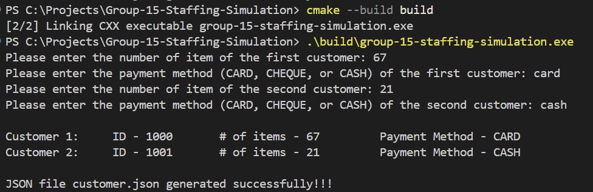
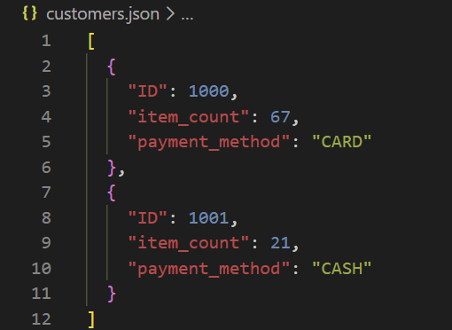

# Customer Class + JSON Output (Prototype)

**Status:** Proof-of-concept for JSON output serialization using the `Customer` class. 

> [!IMPORTANT]
> This is an initial proof-of-concept. Input validation and user-entry automation are currently pending implementation.

## Project Requirements
* **Compiler:** C++17 compatible (GCC 13.2+ / MSVC 2019+)
* **Build System:** CMake 3.15+
* **Dependencies:** `nlohmann/json` (automatically fetched via CPM.cmake).

## Build & Execution

Follow these steps in your terminal (Git Bash, PowerShell, or Command Prompt) to build and run the prototype:

### **Using Bash / Terminal**
```bash
# 1. Generate build files (Configure)
cmake -S . -B build

# 2. Compile the executable (Build)
cmake --build build

# 3. Run the program
# On Windows:
./build/group-15-staffing-simulation.exe

# On Linux/macOS:
./build/group-15-staffing-simulation
```

## Current Implementation Details
The program currently demonstrates:
* Basic Object-Oriented modeling of a `Customer`.
* Automated dependency management for external libraries.
* Successful serialization of C++ objects into a standard JSON array.
* A basic JSON output of 2 customers based on user-input

## TODO List
- [ ] **Temporal Modeling:** Add `arrival_time` data point to `Customer` class (Time since 8:00 AM in seconds).
- [ ] **Sorting:** Implement a sorting algorithm to ensure JSON output follows chronological arrival.
- [ ] **Validation:** Add input validation for item counts and payment methods.
- [ ] **Automation:** Transition manual entry into a loop-based system for $N$ customers.

## Note on Simulation Time
The simulation covers a 12-hour store window (8:00 AM to 8:00 PM).
* **Total Duration:** 43,200 seconds.
* **Internal Representation:** All time is tracked as an integer (seconds) to simplify simulation math.
* **UI/UX:** Conversion logic for readable time (HH:MM:SS) will be handled in the final GUI layer.

## Sample Assets
A sample `customers.json` is included in the repository for format verification.
A sample `customers.json` is included in the repository for reference. Below are some pictures of the output:

### Terminal Interface


### Generated JSON File

